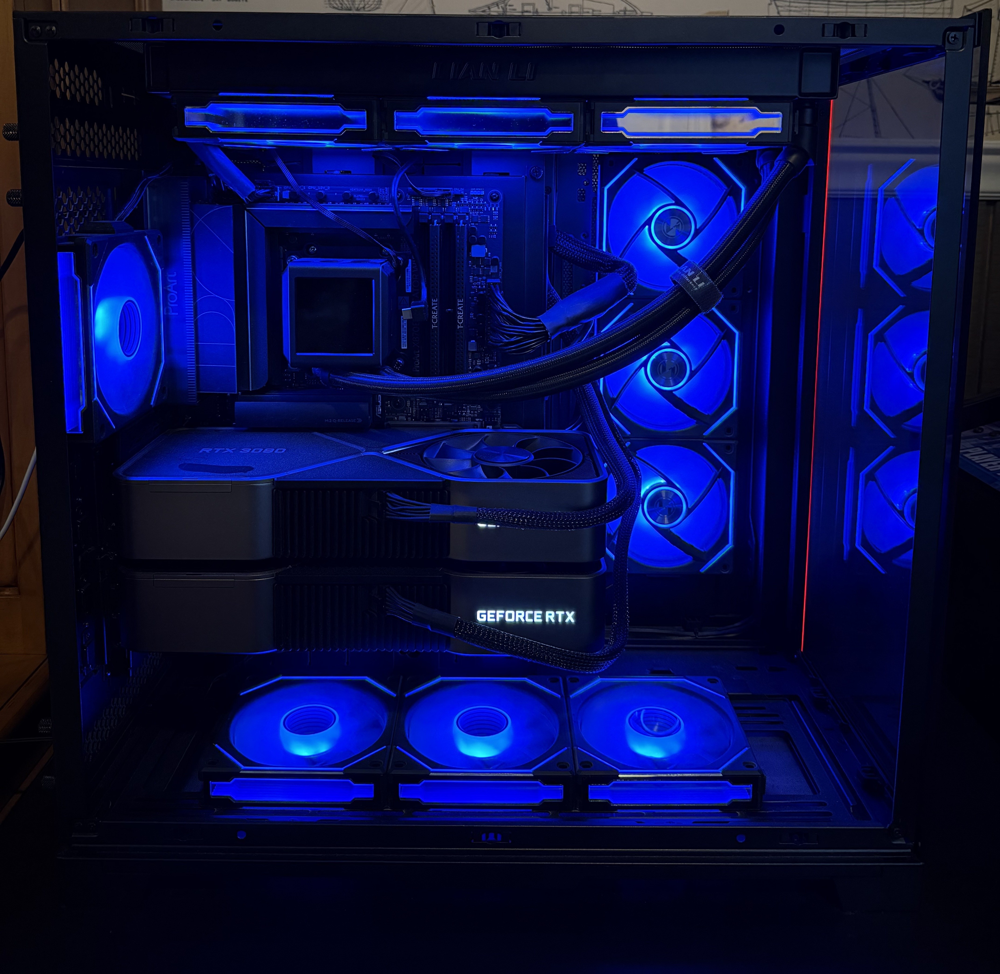
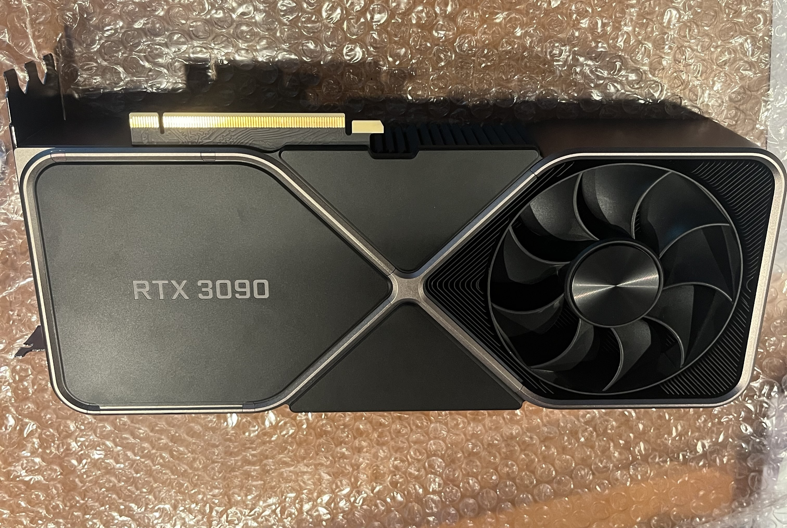
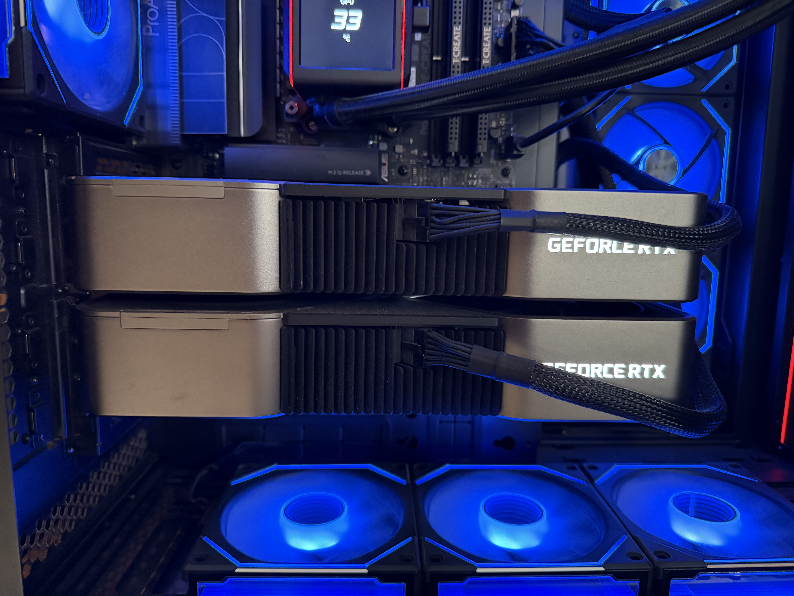
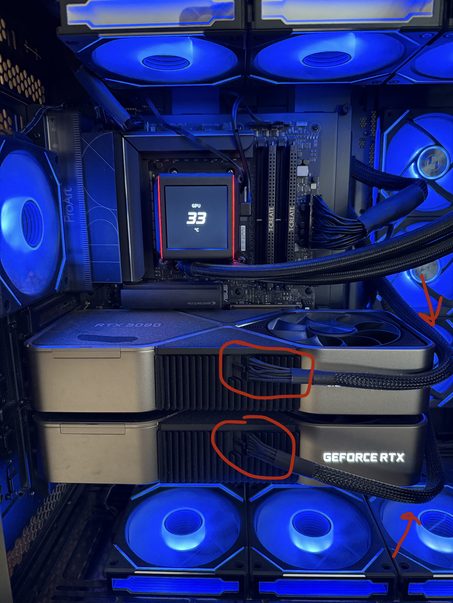
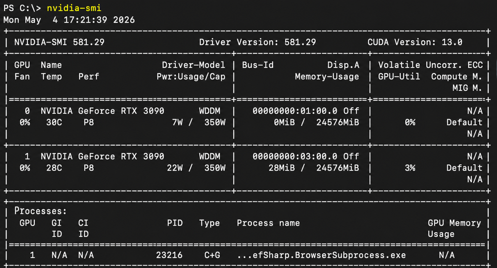
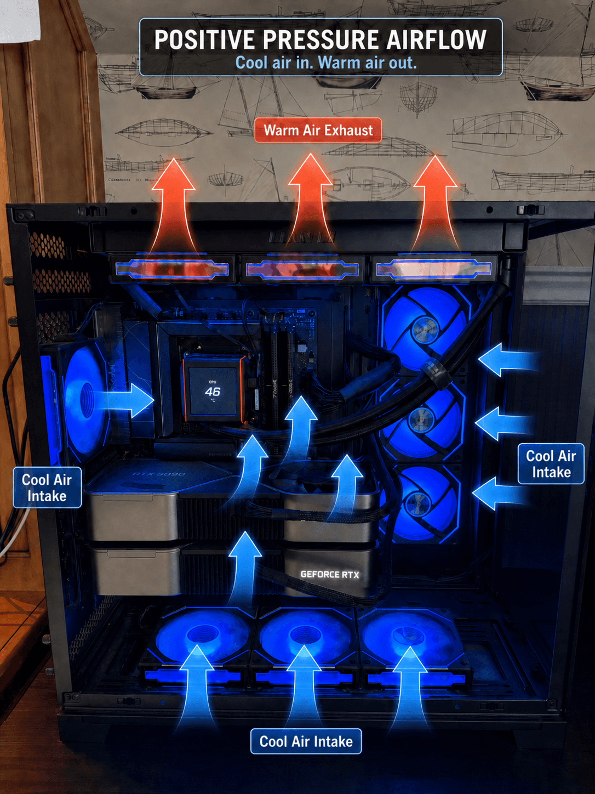
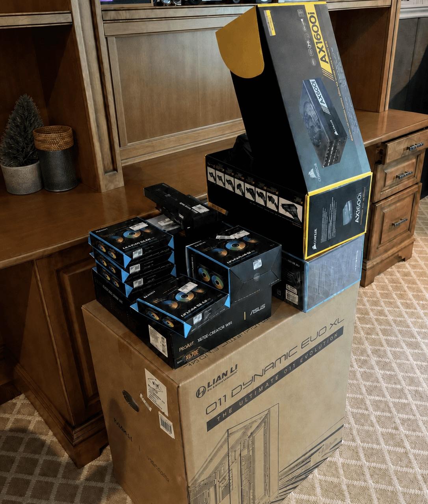

# Local LLM Infrastructure

> **Status: V1 complete and in production.** Running continuously since fall 2024.

Documented, working dual-GPU AI cluster for local large language model inference, fine-tuning, and research. **48 GB combined VRAM. $5,335 all-in.**

This repo contains hardware specifications, operational scripts, and documentation for a purpose-built local AI workstation — paired with a long-form blog series breaking down every decision, mistake, and lesson learned.



---

## V1 — Specs at a glance

|  |  |
|---|---|
| **GPUs** | 2x NVIDIA RTX 3090 Founders Edition (48 GB total VRAM, 3rd-gen NVLink-capable) |
| **CPU** | AMD Ryzen 9 7950X3D (16C / 32T, AM5) |
| **RAM** | 96 GB DDR5-6800 (running at 6000 MT/s, FCLK 1:1) |
| **Storage** | Samsung 990 PRO 2TB NVMe (PCIe Gen 4) |
| **PSU** | Corsair AX1600i (1600W, 80+ Titanium) |
| **Cooling** | 360mm AIO + 10x 120mm fans, positive pressure |
| **Case** | Lian Li O11 Dynamic EVO XL |
| **OS** | Windows 11 Pro (V2 → Ubuntu 22.04 LTS) |
| **Remote access** | SSH over Tailscale mesh VPN |
| **Total cost (with tax)** | **$5,335.30** |
| **Build status** | **Complete — running in production since fall 2024** |

Full hardware spec with prices, PCIe configuration, and power profile: [`docs/hardware-spec.md`](docs/hardware-spec.md)

---

## Gallery

| | |
|---|---|
|  |  |
| *Founders Edition RTX 3090 — one of two purchased* | *0.25" between 2 FE cards — top GPU thermal challenge* |
|  |  |
| *12-pin connectors fully seated, cable slack maintained* | *Both cards healthy and idle. 48 GB VRAM available* |
|  |  |
| *Positive pressure airflow: 7 intake, 3 exhaust* | *Pre-build parts haul. Six weeks to a working cluster* |

---

## The full build story

The V1 build is documented in long-form on the blog:

**[48 GB of VRAM and a Dream — Part 1: The Build](https://blog.zacharycangemi.com/2026/04/29/48-gb-of-vram-and-a-dream-part-1-the-build/)**

Topics covered: GPU selection (3090 vs 4090 vs A6000), 12-pin power connector safety, PCIe lane bifurcation gotchas, dual-GPU thermal management, NVLink reality (training vs inference), RAM crisis context, Windows-vs-Linux migration risk, and Tailscale-based remote access.

Part 2 (price-then-vs-now comparison) and Part 3 (the AI research running on this machine) are forthcoming.

---

## Repo structure

```
.
├── README.md                — this file
├── LICENSE                  — MIT
├── docs/
│   ├── hardware-spec.md     — complete V1 parts list, PCIe config, power profile
│   └── images/              — build photos referenced in this repo and the blog
└── scripts/
    └── power-limit.sh       — set GPU power limit to 280W (lower temps, minimal perf cost)
```

---

## What this rig has run (V1, fall 2024 → present)

- **LLM inference** at 70B+ class with quantization (Q4_K_M, AWQ, GPTQ) and MoE + RAM offloading
- **Fine-tuning** experiments — LoRA, QLoRA, and full-parameter runs
- **Quantization research** across GGUF, AWQ, GPTQ, exllamav2 and llama.cpp
- **Local agentic coding** across Qwen 3.5 27B, Qwen 3.6 27B, Qwen Coder Next, GLM 4.7 Flash — no API limits, no rate caps
- **Stable Diffusion / image-generation pipelines** for AI ad generation work
- **Local OCR** at thousands of pages per hour
- **Personal-communication automation** — agents reading, summarizing, and responding across WhatsApp / iMessage / Telegram, entirely on local GPUs (no data leaves the box)

---

## What's next — V2

V1 is the foundation and stays in production. V2 is currently being built as a separate cluster:

- Ubuntu 22.04 LTS from day one (no WDDM driver overhead, no forced auto-reboots)
- Expanded VRAM
- Full Linux stack — CUDA, cuDNN, PyTorch, Docker, vLLM
- Inference configs (Docker compose for OpenWebUI + inference backend) and benchmark data will land here as V2 comes online

---

## About

Built and maintained by [Zachary Cangemi](https://zacharycangemi.com) — Senior Data Scientist working on applied AI research and local AI infrastructure.

[Blog](https://blog.zacharycangemi.com) · [Portfolio](https://zacharycangemi.com/portfolio.html)

---

## License

MIT — see [LICENSE](LICENSE).
